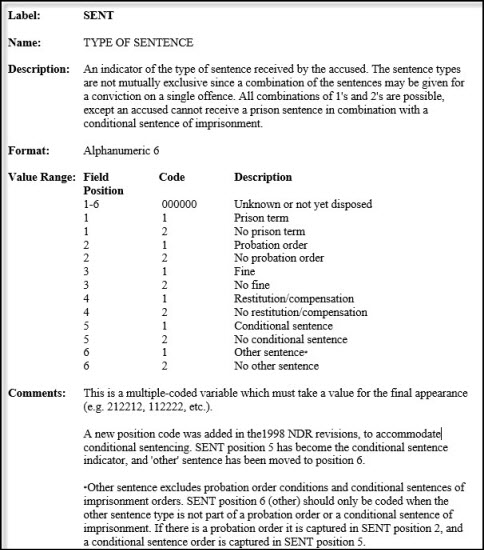

## Plan  

 

 
[https://digitalbevaring.dk/](https://digitalbevaring.dk/)  

### Première partie: de l'importance des données bien ordonnées

  1. Données de recherche -> de quoi parle-t-on?  
  2. Gestion des données et cycle de vie de la recherche  
  3. Pourquoi la GDR? Avantages  
  4. Enjeux de la reproductibilité  
  5. GDR vs Reproductibilité ?  
  6. Initiatives pour changer la “culture” de la recherche  
  7. Prioriser ses activités de GDR 

### Deuxième partie: quelques bonnes pratiques

   1. Planifier  
   2. Organiser  
   3. Documenter  
   4. Diffuser  

---

## 1. Données de recherche -> de quoi parle-t-on?

   

### Multitude de définitions - grande variation selon les disciplines en fonction de leurs objets de recherche

> "les données de la recherche sont définies comme des enregistrements factuels (chiffres, textes, images et sons), qui sont utilisés comme sources principales pour la recherche scientifique et sont généralement reconnus par la communauté scientifique comme nécessaires pour valider les résultats de la recherche". - [Principes et lignes directrices de l'OCDE pour l'accès aux données de la recherche financée sur fonds publics](https://www.oecd.org/fr/sti/inno/38500823.pdf)  

 

### Bref, matériaux de base de la recherche:  

- De tous types: données expérimentales, observationelles, de simulation/code
- De toutes formes: images, vidéos, documents, …
- Et formats: pdf, xls, sav, shp, avi, dat, mp3, …
- Données primaires ou secondaires.

## 2. Gestion des données et cycle de vie de la recherche

- Ensemble d’activités qui traitent de la collecte, l’organisation, la documentation, la préservation et la diffusion des données de recherche.
- Des standards et outils se développent pour faciliter chaque étape du processus
- Certains peuvent nécessiter des compétences techniques plus avancées, mais le but n’est pas de se fixer des objectifs inateignables, c’est  d’améliorer ses pratiques.
- Il faut passer outre l’impression de perdre son temps, même si ce travail ingras est encore malheureusement peu reconnu dans beaucoup de disciplines.

[*INIS - Cycle de vie des données*](https://www.unil.ch/openscience/home/menuinst/open-research-data/les-donnees-de-recherche/cycle-de-vie-et-types-de-donnees.html)

## 3. Pourquoi la GDR? 

### Avantages

- Développer de meilleures méthodes de travail comme une meilleure organisation de ses fichiers et une meilleure documentation de ses analyses.  
- Éviter la perte ou la compromission de données.  
- Encourager l’apprentissage d’outils qui facilitent les révisions, les corrections, les ajouts de nouvelles données (processus itératif).  
- Faciliter le partage et la réutilisation des données.  
- Faciliter la collaboration.   

 

- Augmenter la visibilité et l’impact de la recherche.  
- Permettre la validation des résultats et la reproductibilité de la recherche = transparence et intégrité.  
- Respecter les politiques des organismes subventionnaires ([Politique des trois organismes sur la gestion des données de recherche](https://www.science.gc.ca/eic/site/063.nsf/fra/h_97610.html)) et des éditeurs scientifiques ([Peer Reviewers' Openness Initiative (psychologie)](https://www.opennessinitiative.org/)).  
- Mais avant tout, c'est un investissement pour soi-même!  
 

[*1,500 scientists lift the lid on reproducibility*](https://www.nature.com/news/1-500-scientists-lift-the-lid-on-reproducibility-1.19970)  
[*Slow Science*](https://slowscience.be/the-slow-science-manifesto-2/)  
[*Open Science*](https://osf.io/)  

## 7. Prioriser activités de GDR

 

 
Nombreux facteurs à considérer:

 

### Nature des données:  
- Données quantitatives ou qualitatives ?  
- Données primaires ou secondaires ?  
- Données sensibles ou non ? 
- Quantité de données ?  

 

### Nature du projet:  
- Travail individuel ou collectif ?  
- Ressources disponibles ?  
- Potentiel de réutilisation des données à d’autres fins ?  

## Deuxième partie: quelques bonnes pratiques

Il faut tout au long de sa recherche gérer ses données en se posant la question :   

> De quoi aurait besoin un collègue qui voudrait reproduire mes résultats sans mon aide?  

 

### 4 volets essentiels à considérer:

> 1. Planifier
> 2. Organiser
> 3. Documenter
> 4. Diffuser

## 2.1. Bonne pratique #1: Planifier!  

- Beaucoup de questions qu’il vaut mieux se poser au départ: 

> Quels types de données allez-vous recueillir, créer, acquérir? Dans quels formats de fichier vos données seront-elles recueillies? Comment vos données seront-elles  sauvegardées pendant votre recherche? Qui est responsable de quoi?   

Tout commence avec un *Plan de gestion de données de recherche*:  
  
  - Court document (variable!) rédigé au début de la recherche (idéalement!) qui synthétise les pratiques de gestion des données (production, traitement, documentation, diffusion) qui seront appliquées tout au long de la recherche.  
  - Outil de travail  -> Document vivant.  
  - [Assistant PGD](https://assistant.portagenetwork.ca/).  
  

 

  
  

  
[*Research Data Exit Checklist*](https://www.ideals.illinois.edu/handle/2142/111616)  

 

## 2.2. Bonne pratique #2: Organiser!  

### S’armer contre le chaos!  

 

 

 

###     2.2.1. Structure de dossiers  
###     2.2.2. Noms de fichiers/dossiers  
###     2.2.3. Contrôle des versions  
###     2.2.4. Formats de fichiers   
###     2.2.5. Structure des données  
###     2.2.6. Stockage/préservation  

 
 
 
 
 
 
 
 

  
[*info: DataverseNO - Prepare your data*](https://site.uit.no/dataverseno/deposit/prepare//)  

  

## 2.2. Bonne pratique #2: Organiser!

### 2.2.1.	Structure de dossiers

- Créer un dossier *Projet* contenant tous les fichiers.   

-	Structurer en **sous dossiers** pour bien diviser les différents types de fichiers produits (code, graphiques, résultats, données, documentation...).

-	TOUJOURS séparer les **données brutes** (fichier sacré!) des *outputs* (données dérivées/modifiées, générées par analyses...).

- Différents systèmes possibles (par cours, par projet, par fichier...).

[UConcordia - Directory structure](https://library.concordia.ca/research/data/data-files.php?guid=directory)

## 2.2. Bonne pratique #2: Organiser!

### 2.2.2. Noms de fichiers/dossiers

 

- Voir les noms de fichiers comme des *métadonnées* > pas seulement un identifiant mais une description du contenu.  
- L’important est de définir dès le départ une stratégie et de l’appliquer de façon constante : convention de nommage de fichiers.     

  
- [*Catalog of Bad File Naming*](http://20px.com/blog/2015/07/16/catalogue-bad-file-naming/)  
- [Bonnes pratiques de base](https://datacarpentry.org/rr-organization1/01-file-naming/index.html)  
- [Outils de renommage](https://www.bulkrenameutility.co.uk/)   

  

## 2.2. Bonne pratique #2: Organiser!

### 2.2.2. Noms de fichiers/dossiers

 

#### Établir des règles de nommage de fichiers/dossiers -> quelques conseils:

- Noms courts et descriptifs sans mots vides (+ de 31 caractères peut poser problème sur certains systèmes d’exploitation).  
- Pas de signes diacritiques (accents, trémas, cédilles), de caractères spéciaux, de ponctuation, ni d’espaces.  
- Utiliser _ pour délimiter unité de métadonnées et – pour séparer mots (facilite extraction : globbing, regex)  
- Inclure la date de sauvegarde dans un format standardisé (AAAAMMJJ ou AAAA_MM_JJ).  
- Inclure un numéro de version du document incrémenté selon son évolution (Commencer par 0 : 01, 02…)  
- Commencer par du numérique pour faciliter le tri (ordre chronologique ou logique).  
- Bref, des noms significatifs, faciles à chercher, extraire, trier.  

 
 
 

[*Research Projects: File Structure and NamingPrompt Sheet*](https://app.box.com/s/xiipln16t84y1ldwp5c7iefd395sypt4)

## 2.2. Bonne pratique #2: Organiser!

### 2.2.3. Contrôle des versions

 

#### Définir des procédures de gestion de versions de l'ensemble de ses fichier -> quelques conseils:  

1. De bonnes **règles de nommage** peuvent suffire:  
   - Inclure numéro de versions dans convention de nommage (v01, utiliser décimale pour changements mineurs v01.1).  
   - Créer un document où l’on documente la création de nouvelles versions et leur contenu (date, auteur, résumé des changements).  
   - Travail d'équipe: documenter une entente relative à la création de nouvelles versions (quels changements nécessitent la création d’une nouvelle version).   
    
   
2. **Outils de contrôle** de versions pour garder une trace et un historique des anciennes versions de ses fichiers   
   - [Dropbox](https://help.dropbox.com/fr-fr/files-folders/restore-delete/version-history-overview) et [Google Drive](https://support.google.com/drive/answer/2409045?co=GENIE.Platform%3DDesktop&hl=en#) offrent un contrôle minimal de versions  ([OneDrive](https://support.microsoft.com/en-us/office/Files-in-OneDrive-c6ecef2f-c5cc-4415-b677-e2d2151c3c29#ID0EAABAAA=Manage&ID0EBBF=Secure,_protect,_and_restore)).   
   - Pour un contrôle plus serré de projets plus volumineux, utiliser un outil de versionnage comme [Git](https://git-scm.com/)*.   

 

 
 
 
 

  - *Logiciel libre à installer sur son poste qui fonctionne par ligne de commandes (la courbe d'apprentissage est assez raide, il existe par contre des ["clients Git"](https://happygitwithr.com/git-client.html) qui peuvent faciliter les choses. Très bonne intégration avec RStudio). 
  - Souvent utiliser conjointement avec une plateforme web comme GitLab ou GitHub permettant la synchronisation des fichiers sur son poste et le travail collaboratif sur un projet.
  - Permet un archivage pratique des versions bien définies de ses fichiers.

## 2.2. Bonne pratique #2: Organiser!

### 2.2.4. Formats de fichiers  

 

- Rôle important dans la gestion et préservation de données. 
- Au quotidien, on travaille avec le format de fichier correspondant au logiciel utilisé, mais le meilleur format pour la *préservation* n’est pas nécessairement le meilleur pour ses *analyses*, qui n’est pas nécessairement le meilleur pour la *diffusion.*

 

 
**Règle générale pour la préservation et la diffusion**:  
 

- Privilégier les formats non-propriétaires (PDF/A, CSV, TIFF, TXT, XML)  
- Aussi souhaitable de diffuser ses données dans un format propriétaire lorsque celui-ci est largement utilisé par sa communauté scientifique (Stata, SPSS).   

 
**N.B.** Toujours vérifier la présence d'erreurs ou de pertes d'information suite à une conversion de formats ou une compression de fichiers.   

  

- [*Recommended formats (UK Data Service)*](https://ukdataservice.ac.uk/learning-hub/research-data-management/format-your-data/recommended-formats/)  
- [*How to FAIR - File Formats*](https://www.howtofair.dk/how-to-fair/file-formats/#while-you-work)  
- [*Data formats for preservation*](https://www.openaire.eu/data-formats-preservation-guide)  
- [*DANS - Preferred Formats*](https://dans.knaw.nl/en/file-formats/)  

## 2.2. Bonne pratique #2: Organiser!

### 2.2.5. Structure des données

 

 

- Principes de [*Tidy Data*](https://vita.had.co.nz/papers/tidy-data.pdf) (Hadley Wickham)

- Outil de nettoyage: https://openrefine.org/  

- Document de formation [*Open Refine: Au secours des désordonnée*s](https://crlnp.github.io/openrefine/)  

## 2.2. Bonne pratique #2: Organiser!

### 2.2.6. Stockage/préservation

 

#### Se prémunir contre les désastres (perte de données, corruption de fichiers, formats obsolètes) pendant sa recherche (*stockage*) et après (*préservation*).

 

 

**Deux principales causes:**  
1. **Humaine** : suppressions accidentelles, réécriture, copier/coller...  
2. **Infrastructure** : virus, bugs divers d'applications/systèmes/disques...  
 
 

**Quelques questions à se poser**:  
- Backup de quoi? Qu'est-ce qu'on garde? Déterminer ce que l’on fait de ses anciens fichiers (Supprimer? Archiver?)  
- Quand? Dépend de la fréquence des changements  
- Pendant combien de temps? Définir une politique de conservation   
- Où?  
- Qui et comment? (si équipe)  
- Obligation de destruction/conservation? 

 

[Five steps to decide what data to keep](https://www.dcc.ac.uk/guidance/how-guides/five-steps-decide-what-data-keep)

## 2.2. Bonne pratique #2: Organiser!

### 2.2.6. Stockage/préservation

 

 
[MonsieurTI](https://monsieurti.ca/regle-3-2-1-sauvegarde-efficace/)

 **Chaque option a ses avantages et désavantages: accèssibilité, sécurité, espace, obsolescence, perennité**  

  

**Conseils**:   
- Compresser son projet complet avec date suite à des changements majeurs ou à intervalle régulier.  
- Recopier périodiquement ses dossiers de préservation sur de nouveaux mediums (2-5 ans).       
- Outils ([TeraCopy](https://www.codesector.com/teracopy), [md5summer](https://www.md5summer.org/)) pour vérifier l'intégrité des fichiers suite à un transfert(*checksums*). 

- [*Data Backup Options, uscert*](https://www.cisa.gov/uscert/sites/default/files/publications/data_backup_options.pdf)  
- [*Ensure the reliability of your storage media*](https://old.dataone.org/best-practices/ensure-reliability-your-storage-media)  
- [*UK Data Service, Organising, storing and securely handling research data*](https://dam.ukdataservice.ac.uk/media/604451/2016-06-15_storing_data.pdf)  

## 2.2. Bonne pratique #2: Organiser!

### 2.2.6. Stockage/préservation

***Encryption* -> Chiffrement**: Fichiers rendus illibles par l'utilisation d'algorithmes qui codent les données afin de les protéger grâce à un mot de passe. Sans le mot de passe, personne ne peut accéder au contenu.   

 - Toutes données sensibles devraient être encryptées, qu'elles soient sur un portable, une clé USB, espace nuage.   
 
 > "Research files with PII or other confidential information should always be compressed and encrypted before they are transferred from one location to another. This is especially important when transferring files as attachments to email or as files on physical media such as CDs or flash memory drives."  
 
 - La protection d'un portable par mot de passe n'est pas suffisante.  

 

 

**Différentes stratégies possibles**: encrypter son disque complet, certains fichiers, dossiers.  
 

**Différents outils disponibles**:  
  - Certaines clés USB ont d'emblée un mécanisme d'encryption intégré.  
  - L'encryption peut aussi se faire par le biais d'un outil de compression (7-zip).    
  - Certains logiciels comme SPSS, Office (Word, Excel,...) offrent une option de chiffrement à l'enregistrement du fichier.   
  - De nombreux logiciels sont disponibles comme BitLocker (Windows), FileVault (Mac).   
  - Créer des dossiers encryptés: [VeraCrypt](https://VeraCrypt.codeplex.com), [Cryptomator](https://cryptomator.org/).  
 

N.B. L'UdeM n'offre pas d'espace de stockage sécurisé.  
- [*Best Practices for Data Analysis of Confidential Data*](https://ria.princeton.edu/human-research-protection/data/best-practices-for-data-a)  
- [*Encryption for Researchers*](https://osf.io/nx8km/)  
- [*Comparison of Disk Encryption Software*](https://en.wikipedia.org/wiki/Comparison_of_disk_encryption_software)  

## 2.3. Bonne pratique #3: Documenter!

### Documentation + *métadonnées* ("données sur les données")

-  Des données sans *métadonnées* sont inutiles! : essentielles pour comprendre, repérer et utiliser des données.    

- Expliquer ce qu'on a fait, où, quand, comment et pourquoi à chaque étape ayant mené à ses résultats.

- Peut prendre différentes formes, le but est de produire une documentation:  
  - **détaillée**  (mais pas trop)  
  - **compréhensible** (pour des usagers motivés à réutiliser les données)  
  - **maintenue à jour**   
  - **format accessible**   

 

 

[What is Metadata (with examples)](https://dataedo.com/kb/data-glossary/what-is-metadata)

## 2.3. Bonne pratique #3: Documenter!

### 2.3.1. Les fichiers README

- Inclure un Fichier *README*(ou *lisez-moi*) dans le dossier principal (accessoirement dans chaque sous-dossier pour en décrire le contenu).
- Fichier, généralement en format .txt ou .md, où l'on décrit sommairement son projet et les fichiers de données qui se trouvent dans ses dossiers.  

 
 

- *Guide de l'usager* qui peut inclure différentes informations:  
  - Titre, Responsables, coordonnées.  
  - Objectif de la recherche. 
  - Descriptions des fichiers/Image de la structure du dossier.  
  - Description de l'environnement technologique (logiciels, versions, système d'exploitation, dépendances...) .  
  - Format de citation.  
  - Restrictions/Licence d'utilisation.  
  - Méthodologie. 
  
 
N.B. Pour les données secondaires, inclure toute l’information nécessaire sur la source des données primaires pour en assurer la traçabilité ([*provenance*](https://ardc.edu.au/resources/working-with-data/data-provenance/))
 

**Modèles README**:  
- [UQTR](https://uqtr.libguides.com/ld.php?content_id=35593298)  
- [Illinois](https://www.ideals.illinois.edu/handle/2142/96210)  
- [Cornell - Guide to writing "readme" style metadata](https://data.research.cornell.edu/content/readme)  
- [MIT's README file & folder schema example](https://library.concordia.ca/research/data/data-files.php?guid=directory)  

## 2.3. Bonne pratique #3: Documenter!

### 2.3.2. Les Dictionnaires de codes / *Codebooks*

 

 
[ADULT CRIMINAL COURT SURVEY](http://odesi2.scholarsportal.info/documentation/accs-etjca/3312_D6_T3_V1-eng.pdf)  

 

 

- Information détaillée sur la structure et le contenu d'un fichier de données.  
- Description technique et conceptuelle précise de chaque variable et valeur de variables (nom, étiquette, format,description,  valeurs, codes, valeurs manquantes, ...).  
- Débute généralement par une description de l'étude: titre, responsables, table des matières...  
- Peut inclure de l'information méthodologique plus précise: échantillonnage, pondération, ...  
- Peut inclure les tables de fréquences.  

 
 
 
 
 

- [*Codebook Cookbook - Excel*](http://www.medicine.mcgill.ca/epidemiology/joseph/pbelisle/CodebookCookbook/CodebookCookbook.pdf)  
- [*SPSS TUTORIALS: CREATING A CODEBOOK*](https://libguides.library.kent.edu/spss/codebooks)  
- [*How to Make a Data Dictionary*](How to Make a Data Dictionary)  
- [Métadonnées et documentation des enquêtes dans Odesi](http://odesi2.scholarsportal.info/webview/)    
- [Agency for Healthcare Research and Quality -*What is a codebook?*](https://www.icpsr.umich.edu/icpsrweb/content/shared/ICPSR/faqs/what-is-a-codebook.html)  
- [University of Wisconsin Data Services - *Data Management: Data Dictionaries*](https://www.youtube.com/watch?v=Fe3i9qyqPjo)(video)  
- [ICPSR - What is a Codebook?](https://www.icpsr.umich.edu/web/ICPSR/cms/1983)  

## 2.3. Bonne pratique #3: Documenter!

### 2.3.3. Les champs de métadonnées   

[Dataverse UdeM](https://dataverse.scholarsportal.info/dataverse/montreal)  

 

## 2.3. Bonne pratique #3: Documenter!

### 2.3.4. Documenter son code  
  

- **Tout faire avec un script**, de l'importation des données à la présentation des résultats en passant par les manipulations et l'analyse

- Éviter les étapes manuelles par *point and clic* et copier-coller (ex: supprimer colonnes, renommer variables, supprimer des observations...). Excel et SPSS simplifient la vie mais posent problème pour la documentation et le stockage des procédures.

- Si ce n’est pas possible, bien  documenter les étapes pour reproduire les manipulations et la source des données.

- Encore ici, on peut expliquer dans le fichier README comment faire rouler son code et dans quel ordre pour reproduire les résultats, mais c’est encore mieux si on automatise le tout.

- Méthode du *litterate programming* (programmation lettrée): le code et la documentation qui l’explique devaient se trouver dans un même document pour en assurer la reproductibilité donc permettre aux autres chercheurs de comprendre les tâches demandées au logiciel.

- Existe différents outils selon le langage de programmation utilisé (R, Python) mais le concept reste que l’on mélange dans un même document des blocs de code exécutable avec de la rédaction de texte à l’aide d’un langage de balisage (Markdown ou LaTeX) pour générer des documents en différents formats (word, html, pdf). 

[Intro à Rstudio](https://crlnp.github.io/intro-Rstudio/#/)
[Atelier RMarkdown](https://crlnp.github.io/intro-rmarkdown/)

## 2.4. Bonne pratique #4: Diffuser!

 

### 2.4.1. Pourquoi « ouvrir » ses données?

–	De plus en plus d’éditeurs, d’organismes gouvernementaux et de communautés scientifiques le suggèrent ou même l’imposent.    

–	Recherche de [meilleure qualité](https://journals.plos.org/plosone/article?id=10.1371/journal.pone.0026828) avec [meilleure visibilité (impact)](https://peerj.com/articles/175/).  

 

### Où diffuser ses données? Quelques conseils :  
-	Choisir un dépôt de données fiable et pertinent dans sa discipline:  
  - dépôts généralistes, spécialisés, académiques ([Dataverse UdeM](https://dataverse.scholarsportal.info/dataverse/montreal)).  
  - Les dépôts attribuent un identifiant pérenne automatiquement au jeu de données : adresse numérique.  
-	Attribuer une licence à ses données pour définir les usages possibles (la moins restrictive possible).  
-	Diffuser tout le matériel nécessaire à la reproduction (données, scripts, documentation...).  
- Bien documenter les champs de métadonnées lors du dépôt pour faciliter la découvrabilité (Titre, Année, Description, Sujets, Logiciels utilisés...).  
-	Porter une attention particulière à la sensibilité des données (éthique, confidentialité).  

- [*DRYAD - FAIR Data*](https://datadryad.org/stash/best_practices)  
- [*FAIR Principles*](https://www.go-fair.org/fair-principles/)  
- [*Assessing the FAIRness of Data*](Assessing the FAIRness of data)
- [Outils pour les données sensibles du réseau Portage](https://portagenetwork.ca/fr/nouvelles/nouveaux-outils-pour-les-donnees-sensibles/)  

## 2.4. Bonne pratique #4: Diffuser!

### 2.4.2. Conformité aux lois et à l'éthique: données sensibles

- Difficile d'avoir l'heure juste en matière de protection de la confidentialité.    
- Différentes perspectives parfois contradictoires: approche normative (EPTC2 - politique fédérale d'éthique de la recherche) vs juridique (droit relatif à chaque pays ou province - surtout provincial).    

 

**Que dit l'EPTC2?**  

- À la base tous les chercheurs qui oeuvrent au sein d'institutions qui gèrent des subventions des trois conseils doivent se soumettre aux règles de l'EPTC2, après s'appliquent les normes et lois provinciales, institutionnelles...

- Pour des données (même anonymisées) receuillies dans le cadre d'une recherche faites auprès d'individus où le formulaire de consentement ne mentionnait pas explicitement le partage et la rediffusion:

  - Il faut aller chercher le consentement auprès des participants (re-consent).
  - Si c'est impossible, obligation d'aller chercher l'approbation du comité d'éthique en justifiant cette dérogation (selon sensibilité, vulnérabilité...).  

**Donc**:  

- Pas de **consentement** + pas d'**approbation** du CER = pas de partage  

= Nécessité de prévoir le **partage des données dès le début du projet**!  

- [*EPTC2 - Éthique de la recherche avec des êtres humains*](https://ethics.gc.ca/fra/documents/tcps2-2018-fr-interactive-final.pdf)   
- [*Versement des données existantes dans des dépôts publics*](https://ethics.gc.ca/fra/documents/guidance_depositing_data-fr.pdf)  
- [Commission d'accès à l'information - Renseignements personnels](https://www.cai.gouv.qc.ca/chercheurs/informations-complementaires/)  
- [Politiques et règlements de l'Université de Montréal](https://recherche.umontreal.ca/responsabilite-en-recherche/ethique-humaine/politiques-applicables/)  
- [Outils pour les données sensibles du réseau Portage](https://portagenetwork.ca/fr/nouvelles/nouveaux-outils-pour-les-donnees-sensibles/)  

## Merci!

### Pour aller plus loin...

[Guide GDR Direction des bibliothèques](https://bib.umontreal.ca/gerer-diffuser/gestion-donnees-recherche)  

[Services aux chercheurs UdeM - Gestion des données de recherche](https://recherche.umontreal.ca/services-aux-chercheurs/gestion-des-donnees-de-recherche/)  

[Alliance de recherche numérique du Canada - Ressources de formation](https://alliancecan.ca/fr/services/gestion-des-donnees-de-recherche/apprentissage-et-ressources/ressources-de-formation)  

[Guide to Social Science Data Preparation and Archiving](https://www.icpsr.umich.edu/web/pages/deposit/guide/)  

